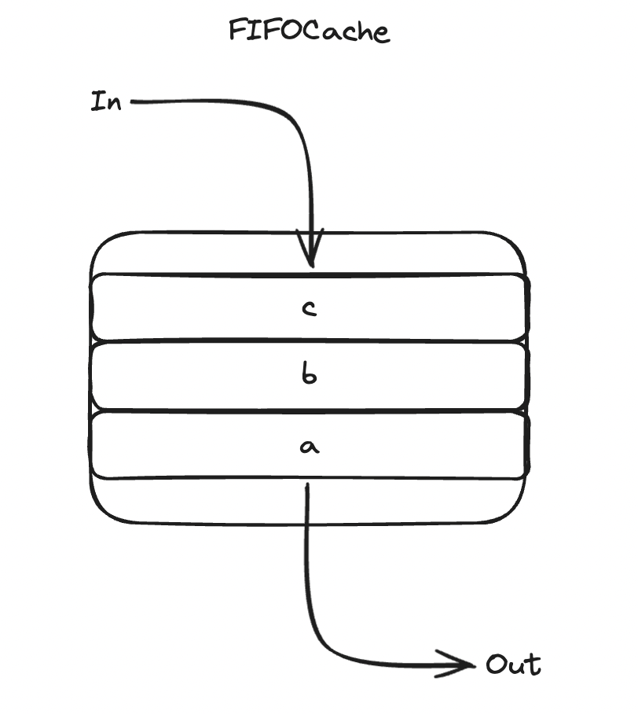
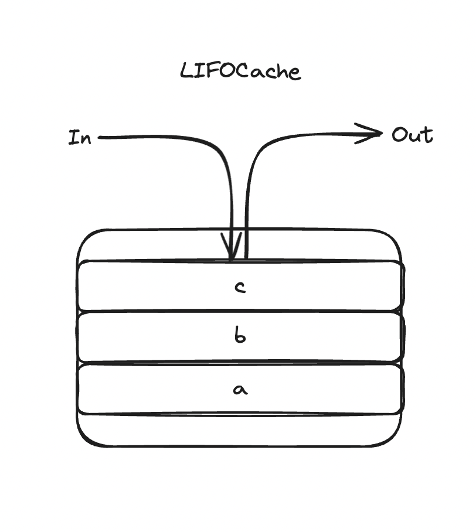
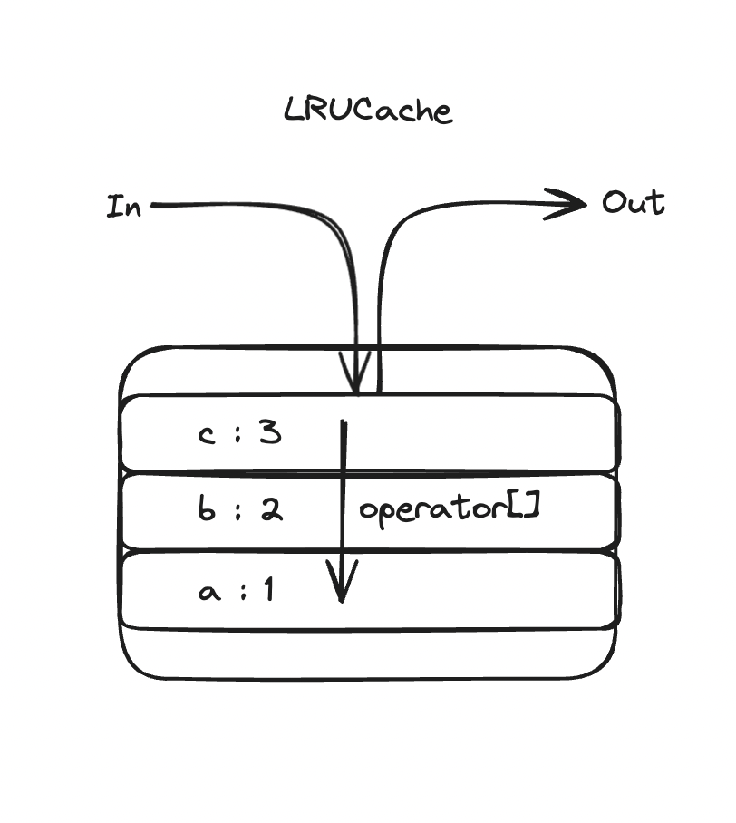
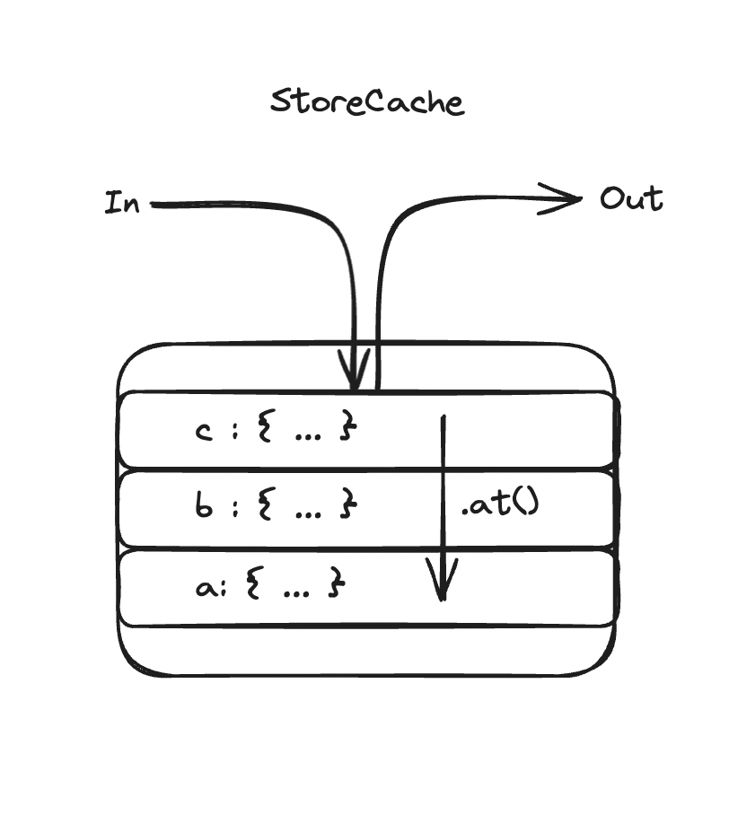

# Caches

Extensible cache templates.


## Installing

`caches` is a header only library and is compatible with C++11.

```bash
conan search caches
```

You can also download the [sources](https://download-directory.github.io?url=https://github.com/JoelLefkowitz/caches/tree/master/src).

## Documentation

Documentation and more detailed examples are hosted on [Github Pages](https://joellefkowitz.github.io/caches).

## Usage

### FIFOCache

- First in, first out
- Fixed size cache with generic `T` elements
- Access by value with `T next() const` and `T last() const`

<div align='center'>
    
</div >

```cpp
#include <string>
#include <caches/queues/fifo_cache.tpp>

caches::FIFOCache<std::string> cache(2);

cache.push("a");
cache.push("b");
cache.push("c");

cache.size() -> 2UL
cache.next() -> "b"
cache.last() -> "c"
```

### LIFOCache

- Last in, first out
- Fixed size cache with generic `T` elements
- Access by value with `T next() const` and `T last() const`

<div align='center'>
    
</div >

```cpp
#include <string>
#include <caches/queues/lifo_cache.tpp>

caches::LIFOCache<std::string> cache(2);

cache.push("a");
cache.push("b");
cache.push("c");

cache.size() -> 2UL
cache.next() -> "c"
cache.last() -> "b"
```

### LRUCache

- Pops the least recently accessed key
- Fixed size cache of generic `K: V` pairs
- Access by value with `operator[](const K &key)`

<div align='center'>
    
</div >

```cpp
#include <string>
#include <caches/stores/lru_cache.tpp>

caches::LRUCache<std::string, int> cache(2);

cache.store("a", 1);
cache.store("b", 2);
cache.store("c", 3);

cache.size() -> 2UL
cache["b"] ->  2
cache["c"] ->  3
```

### StoreCache

- Pops the least recently accessed key
- Fixed size cache of generic `K: V` pairs
- Store with move semantics with `void store(const K &key, V &&value)`
- Access by reference with `V &at(const K &key)`

<div align='center'>
    
</div >

```cpp
#include <string>
#include <caches/stores/store_cache.tpp>

class Resource {
  public:
    size_t id;

    Resource(const Resource &) = delete;

    Resource(Resource &&resource) noexcept : id(resource.id) {}

    ...
};

caches::StoreCache<std::string, Resource> cache(2);

cache.store("a", Resource(1));
cache.store("b", Resource(2));
cache.store("c", Resource(3));

cache.size() -> 2UL
cache.at("b").id -> 2UL
cache.at("c").id -> 3UL
```

### Use case for `caches::StoreCache`

Consider the following scenario:

- You need to generate textures for a game renderer
- You have disabled the copy constructor since they are large objects
- The textures can be given unique names so they can be reused
- Eventually each texture won't be needed when the game scene moves on

The `caches::StoreCache` lets you store the textures in a `map` using their `id`s as keys. They are transferred using move semantics and the least recently used textures are deleted when the container size is reached.

## Tooling

### Dependencies

To install dependencies:

```bash
yarn install
pip install .[all]
conan install .
```

### Tests

To run tests:

```bash
scons test
```

### Documentation

To generate the documentation locally:

```bash
scons docs
```

### Linters

To run linters:

```bash
scons lint
```

### Formatters

To run formatters:

```bash
scons format
```

### Publishing

The [ConanCenter](https://conan.io/center) doesn't yet allow users to publish packages independently. Package recipes are submitted to the [conan-center-index](https://github.com/conan-io/conan-center-index). A copy of this recipe is kept in this repository in the `publish` folder. This allows us to test that the recipe is compatible with new versions and makes it easier to submit updates to the conan-center-index.

To test the recipe can build the latest published tag:

```bash
conan create publish/all/conanfile.py --version $(yq -r ".versions | keys | .[0]" publish/config.yml)
```

This will fetch the sources and create a locally cached version of the package. This version can also be published to a local remote for testing:

```bash
conan upload <package>/<version> -r <remote>
```

### Toolchains

Scripts are defined in the `scripts` folder and can be invoked with `toolchains`:

To generate header guards:

```bash
npx toolchains guards
```

## Contributing

Please read this repository's [Code of Conduct](CODE_OF_CONDUCT.md) which outlines our collaboration standards and the [Changelog](CHANGELOG.md) for details on breaking changes that have been made.

This repository adheres to semantic versioning standards. For more information on semantic versioning visit [SemVer](https://semver.org).

Bump2version is used to version and tag changes. For example:

```bash
bump2version patch
```

### Contributors

- [Joel Lefkowitz](https://github.com/joellefkowitz) - Initial work

## Remarks

Lots of love to the open source community!

<div align='center'>
    
    
    
</div>
